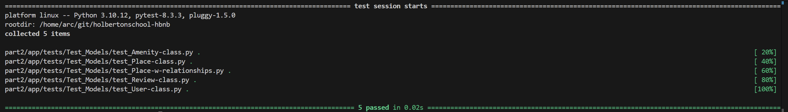

# HBnB Business Logic Layer

## Overview

The **Business Logic Layer (BLL)** is responsible for handling the core operations, relationships, and validation between the main entities in the HBnB application. This layer ensures that the attributes and relationships among entities such as `User`, `Place`, `Review`, and `Amenity` are properly managed.

### Why UUIDs Are Used

Each object in the system uses a **Universally Unique Identifier (UUID)** to ensure uniqueness across distributed systems, enhance security, and support scalability. UUIDs prevent collisions when merging data from multiple sources and make it harder for users to predict or access other users' data.

### Core Entities

#### 1. **BaseModel**

The `BaseModel` class allows sharing common attributs with each of it's subclass (`User`, `Place`, `Review`,`Amenity`).
- `id`: Unique UUID for each instance.
- `created_at`: Timestamp when the instance is created.
- `updated_at`: Timestamp when the instance is last updated.

#### 2. **User**
The `User` class represents an individual who interacts with the system. It includes the following attributes:
- `first_name`: First name of the user (max 50 characters).
- `last_name`: Last name of the user (max 50 characters).
- `username`: Unique username of the user (max 50 characters).
- `email`: Unique email of the user.
- `localisation`: City where the user lives (max 50 characters)
- `is_admin`: Boolean indicating if the user has admin privileges (default `False`).


#### 3. **Place**
The `Place` class represents a property listed in the system. It includes:
- `placename`: Title of the place (max 50 characters).
- `description`: Optional detailed description of the place.
- `price`: Price per night (must be positive).
- `latitude`: Latitude of the location (between -90.0 and 90.0).
- `longitude`: Longitude of the location (between -180.0 and 180.0).
  - `adress`: variable created by combining latitude and longitude into a tuple
- `owner`: Reference to a `User` who owns the place.
  - `reviews`: List of reviews associated with the place.
  - `amenities`: List of amenities available at the place.

#### 4. **Review**
The `Review` class represents a review left by a user for a place. It includes:
- `title`: Title of the review (max 50 characters)
- `text`: Content of the review.
- `rating`: Integer rating between 1 and 5.
- `placename`: Reference to the `Place` being reviewed.
- `owner`: Reference to the `User` who wrote the review.

#### 5. **Amenity**
The `Amenity` class represents an amenity available at a place. It includes:
- `title`: Name of the amenity (e.g., "Wi-Fi", "Parking", max 50 characters).

### Example Usage

#### Creating a User

```python
"""
Module to test the creation of a User.
This module verifies that a User instance can be created with the
required attributes and checks the integrity of the User's data.
"""

import pytest
from app.models.user import User
from app.models.PseudoDataBase import username_list, users_id_list, email_list, phonenumber_list

# Clearing the pseudo-database before each test
@pytest.fixture(autouse=True)
def clear_pseudo_database():
    """
    Fixture to clear the pseudo-database before each test.
    
    This ensures that each test starts with a clean state, removing any
    leftover data in the pseudo-database. It clears all lists related
    to users, including usernames, user IDs, emails, and phone numbers.
    """
    username_list.clear()
    users_id_list.clear()
    email_list.clear()
    phonenumber_list.clear()

def test_user_creation():
    """
    Test the creation of a User instance.
    
    This test verifies that a User can be instantiated with the 
    required attributes (first_name, last_name, username, password, 
    email, localisation, and phone_number). It also checks if the 
    default value of is_admin is set correctly.

    Assertions:
    - The User's first name, last name, username, password, email, 
      localisation, and phone number are correctly set.
    - The default value of is_admin is False.
    """
    user = User(
        first_name="John",
        last_name="Doe",
        username="Jojo",
        password="Jojo1234",
        email="john.doe@example.com",
        localisation="Paris",
        phone_number="0102030405"
    )
    
    # Test if attributes correspond to the creation
    assert user.first_name == "John"
    assert user.last_name == "Doe"
    assert user.username == "Jojo"
    assert user.__password__ == "Jojo1234"
    assert user.email == "john.doe@example.com"
    assert user.localisation == "Paris"
    assert user.phone_number == "0102030405"
    assert user.is_admin is False  # Default value
    print("User creation test passed!")

# Running the test manually
test_user_creation()

```

#### Creating a Place

```python
"""
Module to test creating a Place.
This module verifies that a Place instance can be created with the
required attributes and checks the integrity of the Place's data.
"""

import pytest
from app.models.place import Place
from app.models.user import User
from app.models.PseudoDataBase import (
    users_id_list,
    places_id_list,
    review_id_list,
    amenity_id_list,
    username_list,
    phonenumber_list,
    email_list,
    placename_list,
    places_adress_list,
    review_list,
    amenity_list
)

# Clearing the pseudo-database before each test
@pytest.fixture(autouse=True)
def clear_pseudo_database():
    """
    Fixture to clear the pseudo-database before each test.
    
    This ensures that each test starts with a clean state, removing any
    leftover data in the pseudo-database. It clears all lists related
    to users, places, reviews, amenities, and contact information.
    """
    users_id_list.clear()
    places_id_list.clear()
    review_id_list.clear()
    amenity_id_list.clear()
    username_list.clear()
    phonenumber_list.clear()
    email_list.clear()
    placename_list.clear()
    places_adress_list.clear()
    review_list.clear()
    amenity_list.clear()

def test_place_creation():
    """
    Test the creation of a Place instance.
    
    This test verifies that a Place can be instantiated with the
    required attributes (placename, description, price, latitude,
    longitude, and owner). It checks that these attributes are set
    correctly upon creation.

    Assertions:
    - The Place's placename is correctly set.
    - The Place's description is correctly set.
    - The Place's price is correctly set.
    - The Place's address (latitude and longitude) is correctly set.
    - The owner of the Place is correctly set.
    """
    owner = User(
        first_name="Olivier",
        last_name="Jesaispas",
        username="Oli",
        password="Test02",
        email="Olivier@example.com",
        localisation="Thonon",
        phone_number="0102030405"
    )
    
    place = Place(
        placename="Holberton School Thonon",
        description="This is a school",
        price=15.5,
        latitude=46.37016323447714,
        longitude=6.479164831619981,
        owner=owner
    )

    # Test if attributes correspond to the creation 
    assert place.placename == "Holberton School Thonon"
    assert place.description == "This is a school"
    assert place.price == 15.5
    assert place.adress == (46.37016323447714, 6.479164831619981)
    assert place.owner.username == "Oli"
    print("Place creation test passed!")

# Running the test manually
test_place_creation()

```

#### Creating a Place with adding a Review and an Amenity

```python
"""
Module to test the creation of a Place with relationships.
This module verifies that relationships between Place, Review, and Amenity 
are correctly handled, ensuring that Reviews and Amenities can be 
associated with a Place instance.
"""

import pytest
from app.models.place import Place
from app.models.user import User
from app.models.amenity import Amenity
from app.models.review import Review

from app.models.PseudoDataBase import (
    users_id_list,
    places_id_list,
    review_id_list,
    amenity_id_list,
    username_list,
    phonenumber_list,
    email_list,
    placename_list,
    places_adress_list,
    review_list,
    amenity_list
)

# Clearing the pseudo-database before each test
@pytest.fixture(autouse=True)
def clear_pseudo_database():
    """
    Fixture to clear the pseudo-database before each test.
    
    This ensures that each test starts with a clean state, with no leftover
    data in the pseudo-database. It clears all lists related to users, places,
    reviews, and amenities before running a test.
    """
    users_id_list.clear()
    places_id_list.clear()
    review_id_list.clear()
    amenity_id_list.clear()
    username_list.clear()
    phonenumber_list.clear()
    email_list.clear()
    placename_list.clear()
    places_adress_list.clear()
    review_list.clear()
    amenity_list.clear()

# Test case for creating a place with reviews and amenities
def test_place_w_relationships_creation():
    """
    Test the creation of a Place and the addition of Reviews and Amenities.
    
    This test ensures that a Place instance is correctly created with the
    required attributes (placename, description, price, latitude, longitude, 
    and owner). It then verifies the following:
    
    - Adding a Review to the Place works correctly and the review's attributes 
      (title, text, rating, and placename) match the expected values.
    - Adding an Amenity to the Place works, and the amenity's title is 
      correctly set and associated with the Place.
    
    Assertions:
    - The Place's placename, price, and reviews are correctly initialized.
    - The Review is correctly associated with the Place and can be retrieved.
    - The Amenity is successfully associated with the Place.
    """
    owner = User(
        first_name="Alice",
        last_name="Smith",
        username="Lili02",
        password="Test01",
        email="alice.smith@example.com",
        localisation="Paris",
        phone_number="0203040506"
    )
    
    place = Place(
        placename="Cozy Apartment",
        description="A nice place to stay",
        price=100,
        latitude=37.7749,
        longitude=-122.4194,
        owner=owner
    )

    # Adding a review to the place
    review = Review(
        title="Great stay!",
        text="The place was cool and clean, great job!",
        rating=5,
        placename=place.placename,
        owner=owner
    )
    place.add_review(review)

    # Test if attributes correspond to the creation of the place and review
    assert place.placename == "Cozy Apartment"
    assert place.price == 100
    assert len(place.myreviews) == 1
    assert place.myreviews[0].title == "Great stay!"
    assert place.myreviews[0].text == "The place was cool and clean, great job!"
    print("Place creation and review association test passed!")

    # Adding a new amenity to the place
    pool = Amenity(title="Pool")
    place.add_amenity(pool)

    # Test if the amenity was correctly added to the place
    assert place.myamenities[0].title == "Pool"
    print("Amenity addition test passed!")

# Running the test manually
test_place_w_relationships_creation()

```

#### Result of each test with pytest (unitest)




### Relationships Between Entities

- **User to Place**: A `User` can own multiple `Place` instances.
- **Place to Review**: A `Place` can have multiple `Review` instances.
- **Place to Amenity**: A `Place` can have multiple `Amenity` instances.

Each of these relationships is managed within the classes, ensuring proper validation and easy access to related data.

### Conclusion

The **Business Logic Layer** in the HBnB application handles the core operations and interactions between the entities. By following the class design outlined above, we ensure data consistency, scalability, and maintainability across the system.
