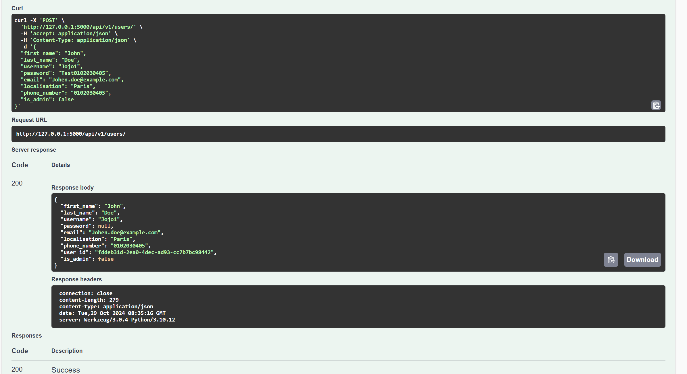
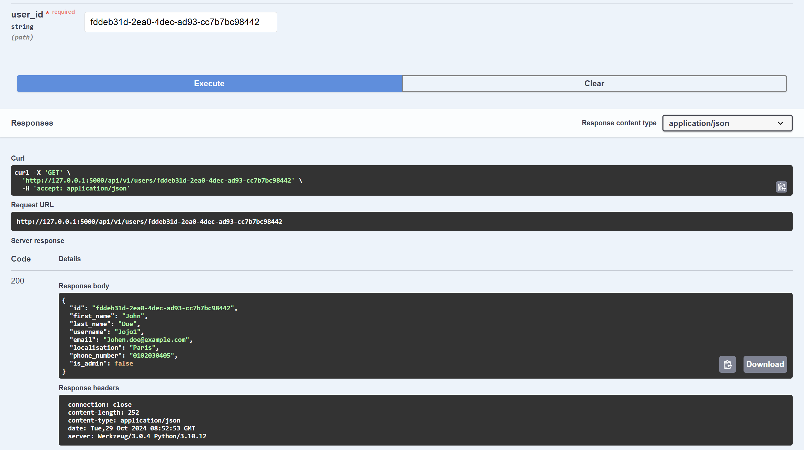

# Methods tests

This document is meant to sum up the test and especially to help me to just have to copy and past my test instead of rewriting each time.

## User methods

### POST

*Payload to put into Swagger documentation:*

```bash
{
  "first_name": "John",
  "last_name": "Doe",
  "username": "Jojo1",
  "password": "Test0102030405",
  "email": "Johen.doe@example.com",
  "localisation": "Paris",
  "phone_number": "0102030405",
  "is_admin": false
}
```



*CURL version:*
```bash
curl -X POST http://localhost:5000/api/v1/users/ \
-H "Content-Type: application/json" \
-d '{
  "first_name": "John",
  "last_name": "Doe",
  "username": "Jojo1",
  "password": "Test0102030405",
  "email": "Johen.doe@example.com",
  "localisation": "Paris",
  "phone_number": "0102030405",
  "is_admin": false
}'
```

### GET (by ID)

*put the id returned by POST method into the SWAGGER "user_id" request*



*CURL version:*

```bash
curl -X GET http://localhost:5000/api/v1/users/given_id \
-H "Content-Type: application/json"
```

### PUT

...